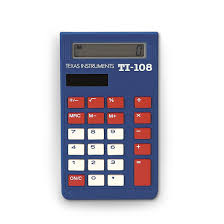

# Calculator Test Plan Project
## Write a Plan to Test a Calculator

In this assignment you will create a test plan to assure the quality of a physical calculator that exists in the real world. 

You will be using Markdown and GitHub to share your work with potential employers, fellow classmates and your instructor.

The specifications of the Calculator
1. Battery/Solar Powered
2. On/Clear function
3. Addition
4. Subtraction
5. Multiplication
6. Division
7. Parathesis
8. Decimal Point
9. 0 thru 9 Numerals
10. Equal Sign
11. Ignore the Six buttons above the Numerals (Three memory buttons and three advanced math buttons)

What is required in the Test Plan that students will submit?
- Testing Strategy/Approach
- Schedule
- Resources needed to test
- Test Cases
- Test Scenarios
- Risks
- Suspension Criteria
- User Base
- Needs to answer these questions:
	- What are it's boundaries?
	- What is the conditions of success?
	- What environment will this be used in?

